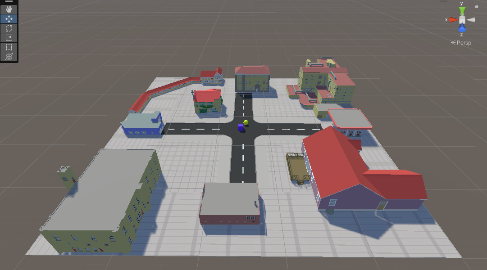
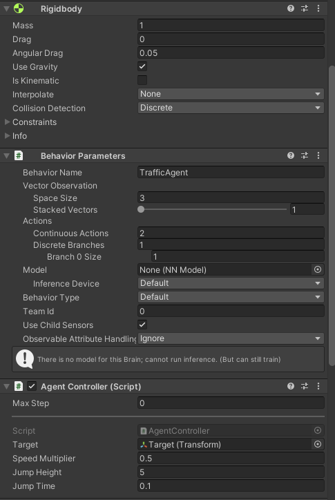
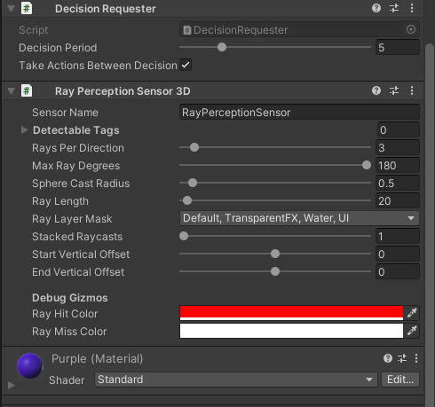
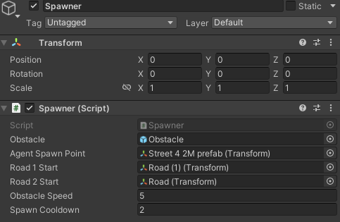
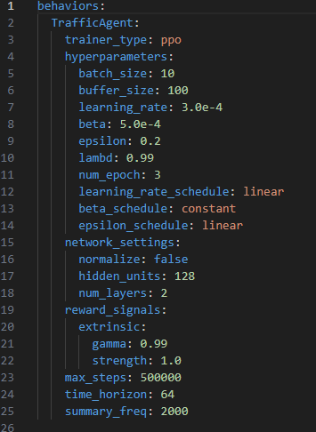
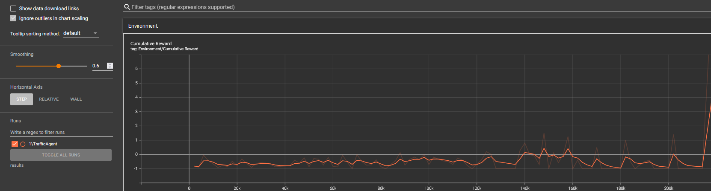

# Documentatie - Jumper

Deze documentatie biedt een stapsgewijze handleiding over hoe het project geïmplementeerd en gereproduceerd kan worden. Het project heeft als doel een agent te trainen om een kruispunt te navigeren, obstakels te vermijden en een doel te bereiken. De agent wordt getraind met behulp van de Unity ML-Agents toolkit.

## Inhoudsopgave
1. Vereisten
2. Installatie
3. Project Setup
4. Training
5. TensorBoard
6. Trainingsvoortgang
7. Final word

### 1. Vereisten
- Unity installatie.
- Anaconda installatie.

### 2. Environment Setup
1. Maak een nieuwe Anaconda omgeving aan (aanbevolen): `conda create -n myenv python=3.9.13`
2. Activeer de omgeving: `conda activate myenv`
3. Installeer de benodigde Python pakketten (PyTorch): `pip3 install torch~=1.7.1 -f https://download.pytorch.org/whl/torch_stable.htm`
4. Installeer ML Agents: `pip install protobuf==3.20.*` en vervolgens `python -m pip install mlagents==0.30.0`
5. Kijk na of de installatie gelukt is: `mlagents-learn --help`

### 3. Project Setup
1. Open Unity Hub en maak een nieuw Unity project aan.
2. Importeer het ML-Agents pakket in je project.
3. Boots een kruispunt na, dit kan je makkelijk doen door de Asset Store te raadplegen. Het asset dat voor dit project gebruikt werd kan je vinden op het volgende link: https://assetstore.unity.com/packages/3d/environments/urban/city-package-107224.

4. Maak de nodige GameObjects aan. In dit geval is dat de Agent en de Target.

 

5. Maak een "Spawner" aan. Deze zal verantwoordelijk zijn voor het creëren van obstakels.

6. Maak een .yaml file aan. Deze file zet je onder de config file in de hoofdmap van het project. In dit project noemt deze file de TrafficAgent.yaml, je kan de configuratie hieronder terugvinden.

   

### 4. Training
1. Open de anaconda prompt en navigeer naar de project hoofdmap.
2. Activeer je Anaconda omgeving: `conda activate myenv`
3. Start de training: `mlagents-learn config/TrafficAgent.yaml --run-id=1`

### 5. TensorBoard Visualisatie
1. Terwijl de training loopt, open een nieuwe anaconda prompt en activeer de omgeving.
2. Start TensorBoard: `tensorboard --logdir results`
3. Open een webbrowser en ga naar `http://localhost:6006` om trainingsmetrieken te visualiseren.

### 6. Trainingsvoortgang
Monitor de trainingsvoortgang in TensorBoard. Bekijk de beloningscurve, beleidsverlies en waardeverliescurves. Naarmate de training vordert, zou de agent moeten leren om het kruispunt te navigeren, obstakels te vermijden en het doel te bereiken.

#### Trainingsinzichten

Voor dit project heb ik de volgende zaken waargenomen:
Tijdens de training leert de agent geleidelijk om obstakels te vermijden en het doel te bereiken. Vanaf een bepaalde punt (200k steps), vertoont de beloningscurve een opwaartse trend, wat aangeeft dat de agent zijn prestaties in de loop van de tijd verbetert. De beleids- en waardeverliescurves zouden ook stabiliseren naarmate de agent convergentie bereikt voor een beter beleid. Het is belangrijk om te experimenteren met hyperparameters zoals leersnelheid om optimale resultaten te behalen. Bovendien kunnen langere trainingsduren leiden tot verbeterde prestaties.

### 7. Final word
Gefeliciteerd! Je hebt met succes een agent geïmplementeerd en getraind om tot een doel te navigeren en obstakels te vermijden. Je project is nu klaar voor verdere experimenten en optimalisatie.

Voor meer informatie, raadpleeg de [Unity ML-Agents documentatie](https://github.com/Unity-Technologies/ml-agents) en ontdek verschillende trainingsstrategieën en omgevingen.
